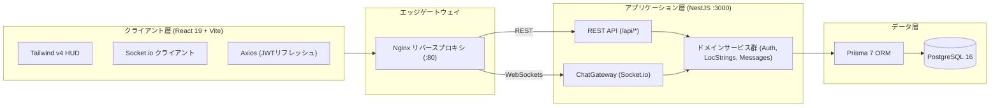

<div align="center">

# CapsLoc — ゲームローカライゼーション & LQA トリアージハブ

[](README.md)
[](README.ja.md)

[](https://www.typescriptlang.org/)
[](https://nestjs.com/)
[](https://react.dev/)
[](https://tailwindcss.com/)
[](https://www.prisma.io/)
[](https://www.postgresql.org/)
[](https://www.docker.com/)

**ゲームローカライゼーションチームとLQAワークフローのために設計された、高パフォーマンス社内コミュニケーションハブ。**

[ライブデモ](#クイックスタート) • [アーキテクチャ詳細](./docs/architecture.md)

<br />
<br />

<a href="https://github.com/createles/capsloc/releases/download/v1.0.0-assets/hero_cockpit.gif" target="_blank">
  
</a>

</div>

## ⚡ 「業務が山積みのときは、CapsLoc」：ローカライゼーションにおけるコンテキストの断絶

AAAゲーム開発において、ゲームローカライゼーションは、対象となる多様な地域やグローバルな文脈全体で作品の一貫したアイデンティティを提供するため、言語、文芸、技術、そして音響の各専門チーム間での迅速な多分野協業を必要とします。そのワークフローの只中には、以下のような課題が存在します：

- **ツールの分断（「Alt-Tab疲労」）**: チームチャット（Slack/Discord）、CATツール（memoQ/Trados）、8万行を超えるマスターExcelシート、Jiraのバグ管理票など、分断されたツールの間を行き来することで、ローカライズチームは膨大なコンテキスト切り替え時間を失っています。
- **コンテキストの断絶**: 翻訳者はゲームエンジン側のテキスト表示枠の制限を知らぬまま台詞を翻訳するため、文字数が長文化しやすい言語（ドイツ語の複合語など）で壊滅的なUIテキストのあふれ・クリッピングを引き起こします。一方、LQAテスターが起票する不具合報告は文字列キーが欠落したトリミング画像であることが多く、特定のために何時間もの文字列調査（アーケオロジー）を強いられています。

## 🎬 CapsLocによるQoL（作業効率）向上

### 1. LocString インスペクター

> _台詞用の `#LOC-MH-003` やUI用の `$STR_ITEM_DEMONDRUG` などのゲーム文字列を正規表現で自動検知し、PostgreSQL内でリレーショナルに関連付け。クリックするとインスペクタードロワーがスライド展開し、日本語原文、文脈ノートの確認やワンクリックコピーが可能です。_

<a href="https://github.com/createles/capsloc/releases/download/v1.0.0-assets/smart_string_codex.gif" target="_blank">
  
</a>

| リアルタイム文字数制限ゲージ & ハザード斜線パターン                                                                                                                                                                                                                                                 | ロールベース権限管理（RBAC）& トランザクション監査履歴                                                                                                                                                                                                                                                 |
| :-------------------------------------------------------------------------------------------------------------------------------------------------------------------------------------------------------------------------------------------------------------------------------------------------- | :----------------------------------------------------------------------------------------------------------------------------------------------------------------------------------------------------------------------------------------------------------------------------------------------------- |
| <a href="https://github.com/createles/capsloc/releases/download/v1.0.0-assets/char_limit_hazard.gif" target="_blank"></a> | <a href="https://github.com/createles/capsloc/releases/download/v1.0.0-assets/rbac_audit_trail.gif" target="_blank"></a> |
| 文字数制限の超過に応じて動的にスケールし、UI枠の文字あふれを防止する警告を描画する動的ゲージ。                                                                                                                                                                                                      | 厳格なRBAC：承認権限は `LOC_PM` または `SOLUTIONS_DEV` ロールに制限。すべてのステータス変更はアトミックな `$transaction` 内でコミットされ、折りたたみ式の監査履歴に記録。                                                                                                                              |

### 公式用語集（Canonical Glossary）検索

> _承認されたゲームおよびシリーズ公式用語をミリ秒単位でインクリメンタル検索。ドロワー内で文脈に即した翻訳禁止（DNT）フラグを提示し、フランチャイズ間の表記揺れや誤訳を未然に防止します。_

<a href="https://github.com/createles/capsloc/releases/download/v1.0.0-assets/glossary_codex.gif" target="_blank">
  
</a>

---

### 2. QAスクリーンショットおよび添付ファイルのステージング

> _不具合タグ（`[UI-OVERFLOW]`, `[LINE-BREAK]` など）付きでバグスクリーンショットを貼り付けまたはドロップ。ステージングされたファイルはメッセージ送信時にアトミックに関連付けられ、1倍〜2.5倍の多段階ズームに対応した内蔵ライトボックスで確認可能です。_

<a href="https://github.com/createles/capsloc/releases/download/v1.0.0-assets/asset_staging_lightbox.gif" target="_blank">
  
</a>

---

### 3. リフローゼロの多言語 UI エンジン

> _厳格に型付けされた228個のキーにわたるコンパイル時の100%辞書パリティと、レイアウトのリフローゼロを実現した瞬時の `EN <-> JA` 言語切り替え。_

<a href="https://github.com/createles/capsloc/releases/download/v1.0.0-assets/bilingual_toggle.gif" target="_blank">
  
</a>

---

## 🏛️ システムアーキテクチャ

CapsLocは、バックエンドとフロントエンド間でコンパイル時TypeScript型定義を共有する**厳格なpnpmモノレポ構成**を採用しています：



詳細な技術仕様は [architecture.md](docs/architecture.md) をご覧ください。

---

## 👥 標準的なローカライズロール & スタジオ組織構造

CapsLocは、ローカライゼーションおよびLQAのライフサイクル全体にわたって厳格な**ロールベース権限管理（RBAC）**を適用し、AAAゲーム開発現場の組織構造を忠実に再現しています。ライブデモにはサンプルのローカライズペルソナがあらかじめ登録されています（共通パスワード: `Password123!`）：

| スタジオロール     | 権限および主な責務                                                                      | シードペルソナ               | 担当領域                       |
| :----------------- | :-------------------------------------------------------------------------------------- | :--------------------------- | :----------------------------- |
| `TRANSLATOR`       | 台詞・テキストの翻訳作成および改訂。翻訳を提案（承認変更権限は制限）。                  | **ダンテ (Dante Sparda)**    | リード日英翻訳                 |
| `LQA_TESTER`       | 文字あふれ、クリッピング、フォント破損のフラグ付け。タグ付き欠陥添付ファイルの起票。    | **ジル (Jill Valentine)**    | 独語・英語HUDトリアージ        |
| `SOLUTIONS_DEV`    | テキストコンテナおよびRE ENGINE枠のエンジニアリング。全ステータス承認権限。             | **レオン (Leon S. Kennedy)** | RE ENGINE UIコンテナ           |
| `LOC_PM`           | ローカライズ制作進行リード。監査履歴を確認し、最終的な文字列承認を付与。                | **エイダ (Ada Wong)**        | ローカライズ制作進行リード     |
| `AUDIO_SPECIALIST` | ボイスオーバー行の長さ、字幕、キャラクター音声キューの管理。                            | **ネロ (Nero)**              | ボイス収録・リップシンク整合性 |
| `GENERAL_USER`     | スタジオ関係者 / 閲覧専用ステークホルダー（ライター、ディレクター、コーディネーター）。 | **春麗 (Chun-Li)**           | スクリプト進行管理             |

---

## 🚀 クイックスタート

### 方法 A: 本番用 Docker Compose（推奨）

```bash
git clone https://github.com/createles/capsloc.git
cd capsloc
docker compose up --build
```

- **Web アプリ**: `http://localhost` (ポート 80)
- **データベース**: PostgreSQL `localhost:5432`

---

### 方法 B: ローカルネイティブ開発

```bash
# 1. 依存関係のインストールと環境設定
pnpm install
cp .env.example apps/server/.env

# 2. マイグレーションと初期データシード
cd apps/server
pnpm exec prisma migrate dev
pnpm exec prisma db seed
cd ../..

# 3. ビルドと同時起動
pnpm build
pnpm dev:server   # ターミナル 1: バックエンド API (ポート 3000)
pnpm dev:client   # ターミナル 2: フロントエンド SPA (ポート 5173)
```

---

## 🧪 検証コマンド

```bash
pnpm build      # ワークスペース全体のコンパイル
pnpm lint       # Oxlintによる全ファイル高速静的解析
pnpm format     # Prettierによるコードスタイル検証
```

---

## ⚖️ 法的表記 & 免責事項

**CapsLoc** は、高パフォーマンスなフルスタックアーキテクチャおよびゲームローカライズ・LQAツールチェーンの実装を示すために開発された、非商用の技術ポートフォリオ兼教育用デモプロジェクトです。

- **商標および知的財産権**: 本プロジェクトで言及されているすべてのゲームタイトル、キャラクター名、およびフランチャイズ関連情報（『モンスターハンター』、『バイオハザード』、『プラグマタ』、『ロックマン』等）は、**株式会社カプコン**の登録商標および知的財産です。
- **非提携の明記**: 本プロジェクトは、株式会社カプコンと提携、承認、後援、またはいかなる関係も有するものではありません。
- **独自実装**: すべてのソフトウェアアーキテクチャ、バックエンドAPI、データベーススキーマ、およびフロントエンドUIは、技術実証および学習目的で作者によって独自に設計・実装されたものです。

---

## 📄 ライセンス

本プロジェクトは [MIT License](LICENSE) のもとで公開されています。Copyright © 2026 Justine Castillo.
