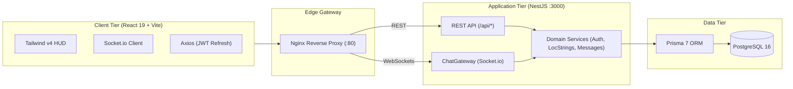

<div align="center">

# CapsLoc — Game Localization & LQA Triage Hub

[](README.md)
[](README.ja.md)

[](https://www.typescriptlang.org/)
[](https://nestjs.com/)
[](https://react.dev/)
[](https://tailwindcss.com/)
[](https://www.prisma.io/)
[](https://www.postgresql.org/)
[](https://www.docker.com/)

**A high-performance internal communication hub built for Game Localization teams and LQA workflows.**

[Live Demo](https://capsloc.up.railway.app/) • [Architecture Breakdown](./docs/architecture.md)

<br />
<br />

<a href="https://github.com/createles/capsloc/releases/download/v1.0.0-assets/hero_cockpit.gif" target="_blank">
  
</a>

</div>

## ⚡ When It's a Lot, use CapsLoc: The Localization Context Gap

In AAA game development, game localization requires fast-moving multi-disciplinary cooperation between the linguistic, literary, technical, and audio teams in order for a Game Project to deliver a consistent identity across the various target locales & global contexts. In the middle of those workflows are:

- **The Tooling Fracture ("Alt-Tab Fatigue")**: Localization teams lose hours context-switching between disconnected tools: studio chat (Slack/Discord), CAT suites (memoQ, Trados), 80,000-row master Excel spreadsheets, and Jira bug trackers.
- **The Context Gap**: Translators localize dialogue in isolation without knowing text-box engine boundaries, leading to catastrophic UI text clipping in length-heavy languages (e.g. German compound expansions). LQA testers flag defects with cropped screenshots lacking string keys, forcing hours of string-key archaeology.

## 🎬 CapsLoc's QoL Upgrades

### 1. The LocString Inspector

> _Game strings for dialogue like `#LOC-MH-003` or UI strings like `$STR_ITEM_DEMONDRUG` are auto-detected via regex and linked relationally in PostgreSQL. Clicking opens the Inspector drawer displaying the Japanese source text, context notes, and 1-click clipboard copy._

<a href="https://github.com/createles/capsloc/releases/download/v1.0.0-assets/smart_string_codex.gif" target="_blank">
  
</a>

| Live Character Limit & Hazard Gauge                                                                                                                                                                                                                                                                 | Role-Based RBAC & Transactional Audit                                                                                                                                                                                                                                                                  |
| :-------------------------------------------------------------------------------------------------------------------------------------------------------------------------------------------------------------------------------------------------------------------------------------------------- | :----------------------------------------------------------------------------------------------------------------------------------------------------------------------------------------------------------------------------------------------------------------------------------------------------- |
| <a href="https://github.com/createles/capsloc/releases/download/v1.0.0-assets/char_limit_hazard.gif" target="_blank"></a> | <a href="https://github.com/createles/capsloc/releases/download/v1.0.0-assets/rbac_audit_trail.gif" target="_blank"></a> |
| Dynamic gauge that scales with character limit overflows and renders a warning to prevent UI clipping.                                                                                                                                                                                              | Strict RBAC: audit approvals are locked to `LOC_PM` or `SOLUTIONS_DEV` roles. Every status change commits in an atomic `$transaction` with collapsible audit history.                                                                                                                                  |

### Canonical Glossary Search

> _Sub-millisecond case-insensitive search across approved game and series terminology providing contextual Do Not Translate (DNT) flags right inside the drawer, preventing franchise naming divergence._

<a href="https://github.com/createles/capsloc/releases/download/v1.0.0-assets/glossary_codex.gif" target="_blank">
  
</a>

---

### 2. QA Screenshots and Attachments Staging

> _Paste or drop bug screenshots with QA defect tags (`[UI-OVERFLOW]`, `[LINE-BREAK]`). Staged files are claimed atomically when the message posts, with a built-in lightbox supporting multi-level zoom (1x to 2.5x)._

<a href="https://github.com/createles/capsloc/releases/download/v1.0.0-assets/asset_staging_lightbox.gif" target="_blank">
  
</a>

---

### 3. Zero-Reflow Bilingual UI Engine

> _Instant `EN <-> JA` language toggle with 100% compile-time dictionary parity across 228 strictly-typed keys and zero layout reflow._

<a href="https://github.com/createles/capsloc/releases/download/v1.0.0-assets/bilingual_toggle.gif" target="_blank">
  
</a>

---

## 🏛️ System Architecture

CapsLoc is structured as a strict **pnpm monorepo** sharing compile-time TypeScript contracts across backend and frontend targets:



For complete technical specifications, see [architecture.md](docs/architecture.md).

---

## 👥 Standard Localization Roles & Studio Hierarchy

CapsLoc models authentic AAA game studio workflows with strict **Role-Based Access Control (RBAC)** across the localization and LQA lifecycle. The Live Demo is seeded with sample localization personas (default password: `Password123!`):

| Studio Role        | Authority & Responsibilities                                                            | Seed Persona        | Domain Focus                         |
| :----------------- | :-------------------------------------------------------------------------------------- | :------------------ | :----------------------------------- |
| `TRANSLATOR`       | Drafts and revises dialogue. Proposes translations; approval mutations restricted.      | **Dante Sparda**    | Lead JA $\rightarrow$ EN Translation |
| `LQA_TESTER`       | Flags text overflows, clipping, and font corruption; uploads tagged defect attachments. | **Jill Valentine**  | German & English HUD Triage          |
| `SOLUTIONS_DEV`    | Engineers text containers and RE ENGINE boundaries; full approval authority.            | **Leon S. Kennedy** | RE ENGINE UI Containers              |
| `LOC_PM`           | Localization Project Manager; reviews audit trails and grants final string approvals.   | **Ada Wong**        | Localization Production Lead         |
| `AUDIO_SPECIALIST` | Manages voice-over line lengths, subtitles, and character audio cues.                   | **Nero**            | Voice-Over & Lip-Sync Alignment      |
| `GENERAL_USER`     | Studio observer / read-only stakeholder (writers, directors, script coordinators).      | **Chun-Li**         | Script Coordination                  |

---

## 🚀 Quickstart

### Method A: Production Docker Compose (Recommended)

```bash
git clone https://github.com/createles/capsloc.git
cd capsloc
docker compose up --build
```

- **Web App**: `http://localhost` (Port 80)
- **Database**: PostgreSQL on `localhost:5432`

---

### Method B: Native Local Development

```bash
# 1. Install & configure
pnpm install
cp .env.example apps/server/.env

# 2. Database migration & clean seed
cd apps/server
pnpm exec prisma migrate dev
pnpm exec prisma db seed
cd ../..

# 3. Build & Run
pnpm build
pnpm dev:server   # Terminal 1: Backend API (Port 3000)
pnpm dev:client   # Terminal 2: Frontend SPA (Port 5173)
```

---

## 🧪 Verification Commands

```bash
pnpm build      # Full workspace compilation
pnpm lint       # Oxlint across all 100+ files
pnpm format     # Prettier code formatting check
```

---

## ⚖️ Legal & Trademark Disclaimer

**CapsLoc** is an independent, non-commercial portfolio and educational project developed to demonstrate high-performance full-stack architectures and game localization tooling workflows.

- **Trademarks & IP**: All game titles, character names, and franchise references (_Monster Hunter_, _Resident Evil_, _Pragmata_, _Mega Man_, etc.) are registered trademarks and intellectual property of **Capcom Co., Ltd.**
- **No Affiliation**: This project is not affiliated with, endorsed by, sponsored by, or connected to Capcom Co., Ltd.
- **Original Architecture**: All software architecture, backend services, database schemas, and frontend interfaces are original implementations created by the author for technical demonstration and learning purposes.

---

## 📄 License

Distributed under the [MIT License](LICENSE). Copyright © 2026 Justine Castillo.
