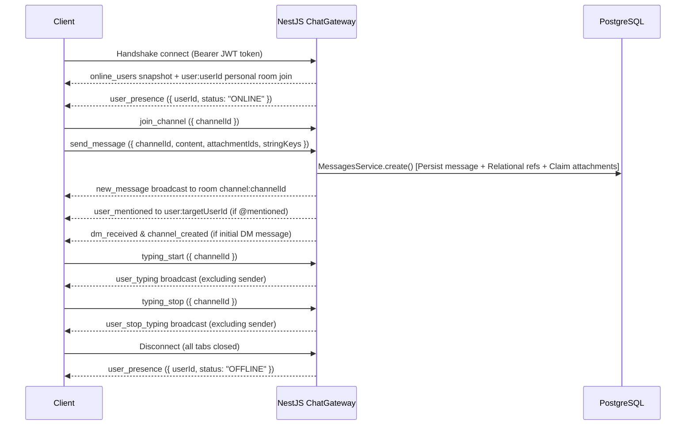

# CapsLoc — System Architecture

## 1. Technology Stack

| Layer                         | Technology                                             | Rationale                                                                                                                                           |
| :---------------------------- | :----------------------------------------------------- | :-------------------------------------------------------------------------------------------------------------------------------------------------- |
| **Monorepo Engine**           | pnpm v11+ workspaces                                   | Efficient package linking, strict dependency isolation, and ultra-fast builds.                                                                      |
| **Backend Framework**         | NestJS v12 (Node.js + TypeScript, ESM)                 | Enterprise-grade modular architecture (Dependency Injection, Controllers, Services, Guards, DTO validation), mirroring C#/.NET backend paradigms.   |
| **Database & ORM**            | PostgreSQL 16 + Prisma 7.10 ORM (`@prisma/adapter-pg`) | Strong relational schema integrity, typed migrations, connection pooling via native `pg` driver, and SQL compatibility.                             |
| **Real-Time Layer**           | NestJS WebSocket Gateway (Socket.io v4)                | Low-latency duplex communication for chat messaging, typing indicators, room broadcasting, and multi-tab user presence.                             |
| **Authentication & Security** | Passport.js + JWT + bcrypt (cost 10)                   | Dual-token strategy: short-lived Access Tokens (Authorization header) + Refresh Tokens (HTTP-only cookie) with rotation and SQL-layer projection.   |
| **Frontend Framework**        | React 19 (Vite v8 + TypeScript)                        | Concurrent rendering, modern hooks, fast Vite HMR, and strict compile-time type safety.                                                             |
| **Styling & UI**              | Tailwind CSS v4 + Lucide Icons                         | Capcom-inspired high-density HUD design system, dark/light theme, and zero-reflow layout architecture.                                              |
| **State Management & Data**   | React 19 Context + Axios Interceptors                  | Dedicated `AuthContext` and `SocketContext` providers with automatic JWT token refresh interception and zero external bundle bloat.                 |
| **File Storage**              | Multer disk storage (`/uploads/`) + Cloudinary adapter | Pre-upload staging pipeline (`messageId: null`) with atomic attachment claiming on message persistence; cloud-ready storage adapter for deployment. |
| **Toolchain & Quality**       | TypeScript ~6.0.3 + Oxlint + Prettier                  | Unified workspace compiler target, sub-second static analysis across 100+ files via Oxlint, and automated code formatting.                          |

---

## 2. Monorepo Workspace Structure

```
capsloc/
├── docs/
│   └── architecture.md
├── LICENSE
├── README.md
├── README.ja.md
├── package.json
├── pnpm-workspace.yaml
├── tsconfig.base.json
├── .gitignore
├── apps/
│   ├── server/                     # NestJS Backend Application
│   │   ├── prisma/
│   │   │   ├── schema.prisma       # Relational Database Schema
│   │   │   ├── prisma.config.ts    # Prisma 7 Database Configuration
│   │   │   ├── seed.ts             # Capcom Dataset Seeding Script
│   │   │   └── migrations/
│   │   ├── src/
│   │   │   ├── app.module.ts
│   │   │   ├── main.ts
│   │   │   ├── common/             # Filters, Interceptors, Decorators, Guards
│   │   │   ├── config/             # Environment validation & configuration
│   │   │   ├── prisma/             # PrismaService with lifecycle hooks & PrismaPg adapter
│   │   │   ├── generated/prisma/   # Generated Prisma Client
│   │   │   ├── modules/
│   │   │   │   ├── auth/           # Login, Register, JWT strategy, refresh tokens
│   │   │   │   ├── users/          # Profiles, Loc roles, safe projections
│   │   │   │   ├── channels/       # Project & Locale Channels, Members, DMs
│   │   │   │   ├── messages/       # Message persistence, #LOC- regex parsing, cursor pagination
│   │   │   │   ├── chat/           # Socket.io duplex gateway & multi-tab presence
│   │   │   │   ├── loc-strings/    # Game string catalog, character limits, status RBAC
│   │   │   │   ├── glossary/       # Canonical Capcom termbase & autocomplete
│   │   │   │   ├── uploads/        # Pre-upload staging & attachment management
│   │   │   │   ├── events/         # Decoupled domain event emitter
│   │   │   │   └── storage/        # File storage provider abstractions
│   │   │   └── test/
│   │   ├── tsconfig.json
│   │   └── package.json
│   │
│   └── client/                     # React 19 + Vite Frontend Application
│       ├── public/
│       ├── src/
│       │   ├── assets/
│       │   ├── components/
│       │   │   ├── auth/           # AuthModal, LoginForm, RegisterForm, RoleSelector
│       │   │   ├── channels/       # ChannelList, ChannelHeader, CreateChannelModal
│       │   │   ├── chat/           # MessageList, MessageItem, MessageInput, TypingIndicator
│       │   │   ├── common/         # Lightbox, ErrorBoundary, Tooltips
│       │   │   ├── inspector/      # LocInspectorDrawer, StringDetailCard, GlossarySearch
│       │   │   ├── layout/         # Header, Collapsible Sidebar, Main Layout
│       │   │   ├── profile/        # UserProfileModal, StatusSelector
│       │   │   └── ui/             # Buttons, Modals, Badges, Dropdowns (Tailwind v4)
│       │   ├── context/            # AuthContext, AuthProvider, SocketContext, SocketProvider
│       │   ├── hooks/              # useAuth, useSocket
│       │   ├── i18n/               # Compile-time typed i18n (en.ts, ja.ts)
│       │   ├── lib/                # Utility helpers (cn, formatters)
│       │   ├── services/           # Axios API modules with JWT refresh interceptors
│       │   ├── App.tsx
│       │   ├── main.tsx
│       │   └── index.css
│       ├── tsconfig.json
│       ├── vite.config.ts
│       └── package.json
│
└── packages/
    └── types/                      # Shared TypeScript Interfaces & DTOs
        ├── src/
        │   ├── auth.types.ts
        │   ├── channel.types.ts
        │   ├── enums.ts
        │   ├── loc-string.types.ts
        │   ├── message.types.ts
        │   ├── socket-events.ts
        │   ├── storage.types.ts
        │   ├── user.types.ts
        │   └── index.ts
        ├── tsconfig.json
        └── package.json
```

---

## 3. Design Patterns & Architecture Principles

1. **Dependency Injection (DI) & Inversion of Control (IoC)**: Leveraged natively across NestJS services, controllers, and gateways to maintain decoupled, unit-testable domain logic.
2. **Repository / ORM Abstraction**: Prisma 7 acts as the typed data mapper with a dedicated `PrismaService` extending `@prisma/adapter-pg`, managing native connection pools and transaction lifecycles.
3. **Gateway / Adapter Pattern**: Real-time event handling segregated into a dedicated `ChatGateway` using Socket.io namespaces, channel rooms, multi-tab presence tracking (`Map<string, Set<string>>`), and lazy DM room enrollment.
4. **Data Transfer Object (DTO) Validation**: Strict runtime validation of incoming REST payloads and Socket messages using `class-validator` and `class-transformer` with `whitelist: true` and `forbidNonWhitelisted: true`.
5. **Component-Driven & Custom Hook Architecture**: Frontend isolates network side-effects and WebSocket lifecycles into dedicated contexts (`AuthContext`, `SocketContext`) and custom hooks (`useAuth`, `useSocket`).
6. **Role-Based Access Control (RBAC) & Audit Integrity**: Strict role authorization on review mutations (`LOC_PM` or `SOLUTIONS_DEV` only). Every string approval commits within an atomic Prisma `$transaction` that inserts an immutable `LocStringAudit` trail entry.
7. **Pre-Upload Staging Pipeline ("Luggage-Claim" Pattern)**: Defect screenshots upload in advance with `messageId: null`, allowing client-side preview and attachment tagging (`[UI-OVERFLOW]`, `[LINE-BREAK]`), claiming attachments atomically upon message submission.
8. **Decoupled Domain Event Emitter**: Internal state changes (e.g., channel sprint status updates, profile modifications) dispatch via `@nestjs/event-emitter` (`channel.updated`, `user.updated`) to trigger WebSocket broadcasts without tight service-to-gateway coupling.

---

## 4. Database Schema (Prisma + PostgreSQL)

```prisma
datasource db {
  provider = "postgresql"
}

generator client {
  provider = "prisma-client"
  output   = "../src/generated/prisma"
}

enum LocRole {
  TRANSLATOR
  LQA_TESTER
  SOLUTIONS_DEV
  LOC_PM
  AUDIO_SPECIALIST
  GENERAL_USER
}

enum ChannelType {
  PUBLIC_PROJECT
  PRIVATE_LOCALE
  DIRECT_MESSAGE
  GROUP_DM
}

enum StringStatus {
  DRAFT
  IN_REVIEW
  APPROVED
  LQA_FLAGGED
}

enum AttachmentType {
  IMAGE
  SCREENSHOT_BUG
  DOCUMENT
  LOG_FILE
}

model User {
  id                 String          @id @default(uuid())
  username           String          @unique
  email              String          @unique
  passwordHash       String
  displayName        String
  avatarUrl          String?
  bio                String?
  customStatus       String?
  locRole            LocRole         @default(GENERAL_USER)
  primaryLocale      String          @default("en-US")
  targetLocales      String[]        @default(["ja-JP"])
  status             String          @default("offline") // online, away, busy, offline
  hashedRefreshToken String?
  createdAt          DateTime        @default(now())
  updatedAt          DateTime        @updatedAt

  sentMessages       Message[]       @relation("UserSentMessages")
  channelMemberships ChannelMember[]
  createdChannels    Channel[]       @relation("ChannelCreator")
  stringAudits       LocStringAudit[]

  @@map("users")
}

model Channel {
  id          String         @id @default(uuid())
  name        String?        // Nullable for DMs
  description String?
  status      String?        // Sprint/Milestone deadline state
  type        ChannelType    @default(PUBLIC_PROJECT)
  projectTag  String?        // e.g., "MH-WILDS", "RE-ENGINE", "DD2"
  localeTag   String?        // e.g., "JA->EN", "EFIGS", "GLOBAL"
  createdById String
  createdBy   User           @relation("ChannelCreator", fields: [createdById], references: [id])
  createdAt   DateTime       @default(now())
  updatedAt   DateTime       @updatedAt

  members     ChannelMember[]
  messages    Message[]

  @@map("channels")
}

model ChannelMember {
  id         String   @id @default(uuid())
  channelId  String
  userId     String
  role       String   @default("member") // admin, member
  joinedAt   DateTime @default(now())
  lastReadAt DateTime @default(now())

  channel    Channel  @relation(fields: [channelId], references: [id], onDelete: Cascade)
  user       User     @relation(fields: [userId], references: [id], onDelete: Cascade)

  @@unique([channelId, userId])
  @@map("channel_members")
}

model Message {
  id          String         @id @default(uuid())
  channelId   String
  senderId    String
  content     String
  isEdited    Boolean        @default(false)
  createdAt   DateTime       @default(now())
  updatedAt   DateTime       @updatedAt

  channel     Channel        @relation(fields: [channelId], references: [id], onDelete: Cascade)
  sender      User           @relation("UserSentMessages", fields: [senderId], references: [id], onDelete: Cascade)
  attachments Attachment[]
  stringRefs  LocStringRef[]

  @@map("messages")
}

model Attachment {
  id        String         @id @default(uuid())
  messageId String?        // Nullable for pre-upload staging
  fileUrl   String
  fileName  String
  fileType  AttachmentType @default(IMAGE)
  fileSize  Int
  localeTag String?        // e.g., "JA-Ref", "DE-Overflow"
  createdAt DateTime       @default(now())

  message   Message?       @relation(fields: [messageId], references: [id], onDelete: Cascade)

  @@map("attachments")
}

model LocString {
  id           String         @id @default(uuid())
  stringKey    String         @unique // e.g., "LOC-MH-001", "STR_ITEM_DEMONDRUG"
  projectTag   String         // e.g., "MH-WILDS"
  sourceText   String         // Japanese original text
  targetLocale String         // e.g., "en-US", "de-DE"
  targetText   String?        // Localized string translation
  charLimit    Int?           // UI boundary constraint
  contextNotes String?        // Screen context / audio context
  status       StringStatus   @default(APPROVED)
  createdAt    DateTime       @default(now())
  updatedAt    DateTime       @updatedAt

  references   LocStringRef[]
  audits       LocStringAudit[]

  @@map("loc_strings")
}

model LocStringRef {
  id          String    @id @default(uuid())
  messageId   String
  locStringId String

  message     Message   @relation(fields: [messageId], references: [id], onDelete: Cascade)
  locString   LocString @relation(fields: [locStringId], references: [id], onDelete: Cascade)

  @@unique([messageId, locStringId])
  @@map("loc_string_refs")
}

model LocStringAudit {
  id          String       @id @default(uuid())
  locStringId String
  userId      String
  oldStatus   StringStatus
  newStatus   StringStatus
  createdAt   DateTime     @default(now())

  locString   LocString    @relation(fields: [locStringId], references: [id], onDelete: Cascade)
  user        User         @relation(fields: [userId], references: [id], onDelete: Cascade)

  @@index([locStringId, createdAt(sort: Desc)])
  @@map("loc_string_audits")
}

model GlossaryTerm {
  id         String   @id @default(uuid())
  termKey    String   @unique
  category   String   // Character, Weapon, Item, Location, Monster
  sourceJa   String   // e.g., "鬼神薬"
  targetEn   String   // e.g., "Demondrug"
  notes      String?  // Lore and localization conventions
  projectTag String   @default("GLOBAL")
  createdAt  DateTime @default(now())
  updatedAt  DateTime @updatedAt

  @@map("glossary_terms")
}
```

---

## 5. API & Real-Time Specifications

### 5.1. RESTful Interfaces

| Method  | Endpoint                       | Purpose                                                                 |
| :------ | :----------------------------- | :---------------------------------------------------------------------- |
| `POST`  | `/api/auth/register`           | Register new user with LocRole and default language pair                |
| `POST`  | `/api/auth/login`              | Authenticate credentials, set 7-day HTTP-only refresh cookie, issue JWT |
| `POST`  | `/api/auth/refresh`            | Rotate refresh token and issue fresh access token                       |
| `POST`  | `/api/auth/logout`             | Invalidate active refresh token in database and clear auth cookie       |
| `GET`   | `/api/auth/me`                 | Fetch authenticated user profile via JWT token                          |
| `GET`   | `/api/users`                   | List all workspace users with safe projection (`safeUserSelect`)        |
| `GET`   | `/api/users/:id`               | Fetch specific user profile details                                     |
| `PATCH` | `/api/users/profile`           | Update caller's profile, avatar, bio, and locale settings               |
| `GET`   | `/api/channels`                | List all public channels and caller's enrolled private/DM channels      |
| `POST`  | `/api/channels`                | Create project or private locale channel                                |
| `POST`  | `/api/channels/dm`             | Idempotently resolve or provision 1-on-1 direct message channel         |
| `GET`   | `/api/channels/unread/summary` | Fetch unread message counts and mentions across all channels            |
| `GET`   | `/api/channels/:id`            | Fetch channel metadata and active member roster                         |
| `PATCH` | `/api/channels/:id`            | Update channel topic, description, or sprint milestone status           |
| `POST`  | `/api/channels/:id/members`    | Enroll user into private channel                                        |
| `GET`   | `/api/channels/:id/messages`   | Fetch cursor-paginated messages (`take: limit + 1` peek-ahead pattern)  |
| `POST`  | `/api/channels/:id/messages`   | Post message, auto-parse `#LOC-` / `$STR_` strings, claim attachments   |
| `POST`  | `/api/uploads`                 | Pre-stage multipart defect screenshot or media attachment               |
| `PATCH` | `/api/uploads/:id`             | Update attachment metadata (e.g. localeTag defect annotation)           |
| `GET`   | `/api/loc-strings`             | Paginated catalog query with project, status, and search filters        |
| `GET`   | `/api/loc-strings/:key`        | Fetch localization string metadata, character budget, and context notes |
| `PATCH` | `/api/loc-strings/:key/status` | Mutate review status with RBAC (`LOC_PM` / `SOLUTIONS_DEV`) and audit   |
| `GET`   | `/api/glossary`                | List canonical terminology, optionally filtered by `?category=`         |
| `GET`   | `/api/glossary/search`         | Case-insensitive autocomplete search across JA/EN terms and keys        |
| `GET`   | `/api/glossary/suggestions`    | Contextual glossary suggestions scoped to active channel's projectTag   |

### 5.2. WebSocket Events (Socket.io)



| Event Name         | Direction        | Payload Structure                                              | Purpose                                                       |
| :----------------- | :--------------- | :------------------------------------------------------------- | :------------------------------------------------------------ |
| `join_channel`     | Client -> Server | `{ channelId: string }`                                        | Subscribe socket to channel room after authorization check    |
| `leave_channel`    | Client -> Server | `{ channelId: string }`                                        | Unsubscribe socket from channel room                          |
| `send_message`     | Client -> Server | `{ channelId, content, attachmentIds?, stringKeys? }`          | Transmit new message payload with staged attachments          |
| `typing_start`     | Client -> Server | `{ channelId: string }`                                        | Broadcast typing indicator to channel room (excluding sender) |
| `typing_stop`      | Client -> Server | `{ channelId: string }`                                        | Clear typing indicator from channel room                      |
| `new_message`      | Server -> Client | `MessageDTO`                                                   | Broadcast newly created message to channel subscribers        |
| `user_typing`      | Server -> Client | `{ channelId: string, userId: string, displayName: string }`   | Notify room members that a user is actively typing            |
| `user_stop_typing` | Server -> Client | `{ channelId: string, userId: string }`                        | Notify room members that a user stopped typing                |
| `user_presence`    | Server -> Client | `{ userId: string, status: UserStatus }`                       | Broadcast user online/offline status transition               |
| `online_users`     | Server -> Client | `{ userIds: string[] }`                                        | Initial snapshot of all currently connected users on connect  |
| `user_mentioned`   | Server -> Client | `{ message, channelId, channelName, channelType, senderName }` | Direct toast alert to @mentioned user's personal room         |
| `dm_received`      | Server -> Client | `{ message, channelId, channelType, senderName }`              | Instant notification to DM recipient with room enrollment     |
| `channel_created`  | Server -> Client | `ChannelDTO`                                                   | Push newly resolved channel directly to recipient sidebar     |
| `channel_updated`  | Server -> Client | `ChannelDTO`                                                   | Live update when sprint status or channel topic changes       |
| `user_updated`     | Server -> Client | `UserProfileDTO`                                               | Live update when user updates avatar, status, or bio          |
| `error`            | Server -> Client | `{ message: string, code?: string }`                           | Fail-closed error notification for invalid operations         |
